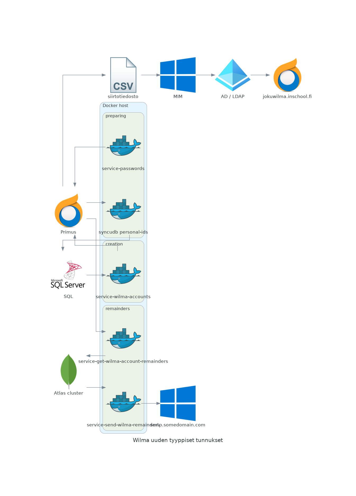

# service-wilma-accounts

Primus opiskelijarekisterin yhteydessä hyödynnettävä mikropalvelu, jonka avulla luodaan yksilöllinen sähköpostiosoitteeseen pohjautuva uuden tyyppinen Wilma-tunnus. Toteutus hyödyntää MS-SQL-palvelimella olevaan käyttäjätietokantaa. Tietokannasta tarkistetaan salatun henkilötunnuksen avulla, onko opiskelijalla olemassa oleva uuden tyyppinen Wilma-tunnus. Mikäli tunnus on olemassa, linkitetään uudelle opiskelijakortille vanha tunnus. Jos henkilötunnusta ei löydy luodaan Primukseen uusi rekisterikortti uudelle tunnukselle. Mikäli opiskelijan HETU ei ole virallinen (esim. maahanmuuttajat) luodaan aina uusi tunnus. syncudb-personal-ids-mikropalvelu päivittää käyttäjätietokantaan Primukseen jälkeenpäin syötetyt henkilötunnukset.

Palvelu on alunperin tarkoitettu ajettavaksi kontissa esim. Kubernetes klusterissa ajastettuna. Mikropalvelu on osa laajempaa sähköisen paikanvastaanoton kokonaisuutta.

Dockerfile, jonka sisälle voi upottaa primusqueryn ja käännetyn binäärin.

https://raw.githubusercontent.com/pasiol/dockerfile-buster-slim-pq/main/Dockerfile

## Käyttö binäärinä

Kääntäminen

    make compile

---
    HOST=palvelimen_osoite PORT=NNNN ./bin/service-wilma-accounts

## Primus-tuontimääritykset

main.go

    newAccountConfig     = ""
	linkOldAccountConfig = ""

## Suodattimet hakija- ja opiskelijarekisteriin

query.go

- täydennä filterit riveille

    pq.Search = ""

## Salaisuudet

config/secrets.go